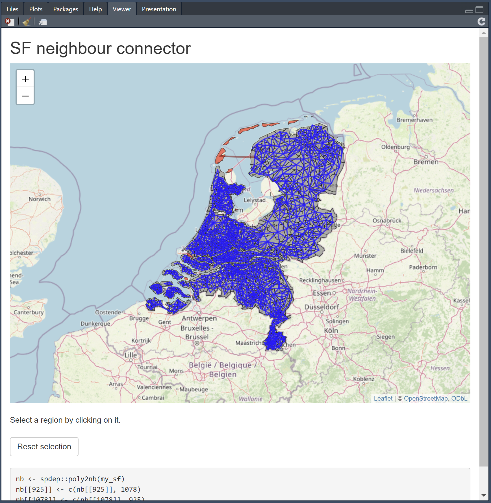

# SF neighbour connector

RStudio addin to quickly add manual connections to `spdep::poly2nb()` neighbour lists based on an `sf` object in your current `R` environment.

> [!WARNING]
> This add-in was mostly vibe-coded because I needed it myself. Use at your own risk.

## Installation

You can install the development version of `{sfneighbourconnector}` like so:

```r
remotes::install_github("vankesteren/sfneighbourconnector")
```

Then, restart your RStudio. The add-in should now be available in the addins dropdown.

## Example

```r
library(sf)
my_sf <- st_read("https://nlgis.nl/api/maps?year=1869")
```

Then select the add-in. Be patient, initial loading can take some time!



## User manual

- Unconnected regions will be shown in red
- Click any region to select it, then click on another region to connect them
- The new connection will be shown in red and the R code at the bottom of the screen will update
- When you're done, copy/paste the R code and run it to get the final neighbours list